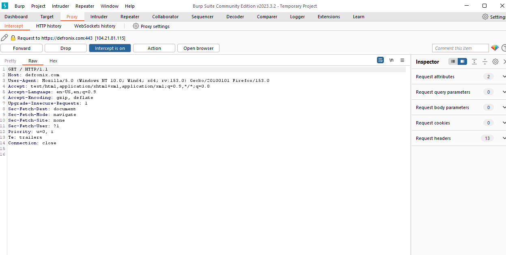
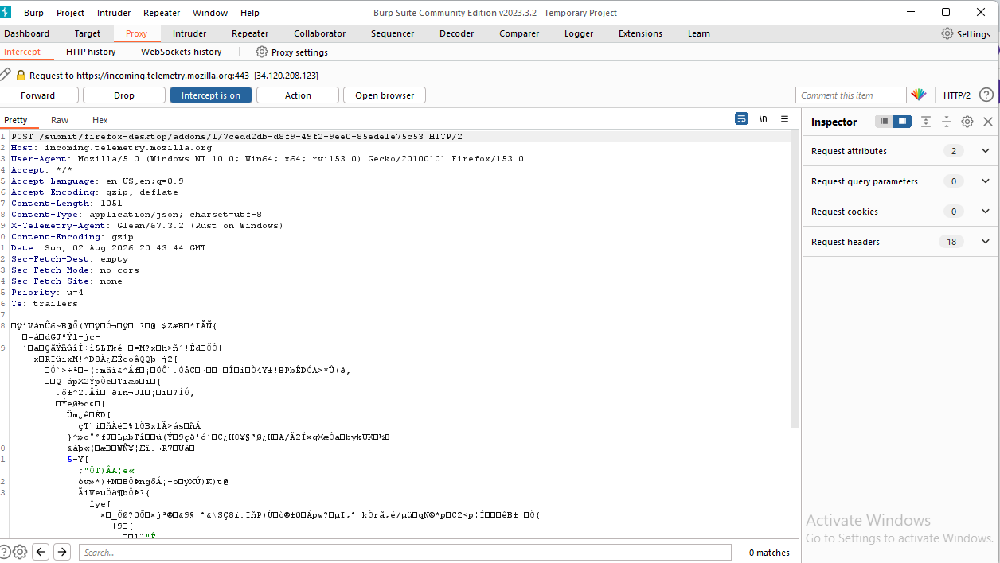
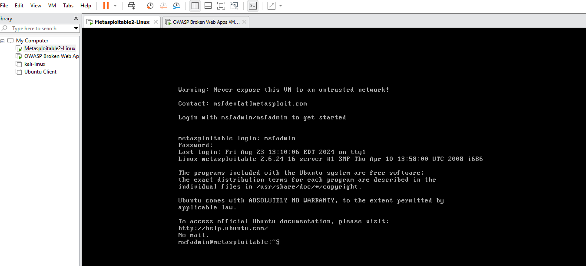

# 📸 Screenshots & Evidence

## Burp Suite Installation

---

## Certificate Adding Process

---

## Certificate Successfully Added

---

## Traffic Interception

---

## Request Analysis

---

## Metasploitable 2 Setup

---

## OWASP Broken Web Applications Setup

---

## TryHackMe Room Completion

